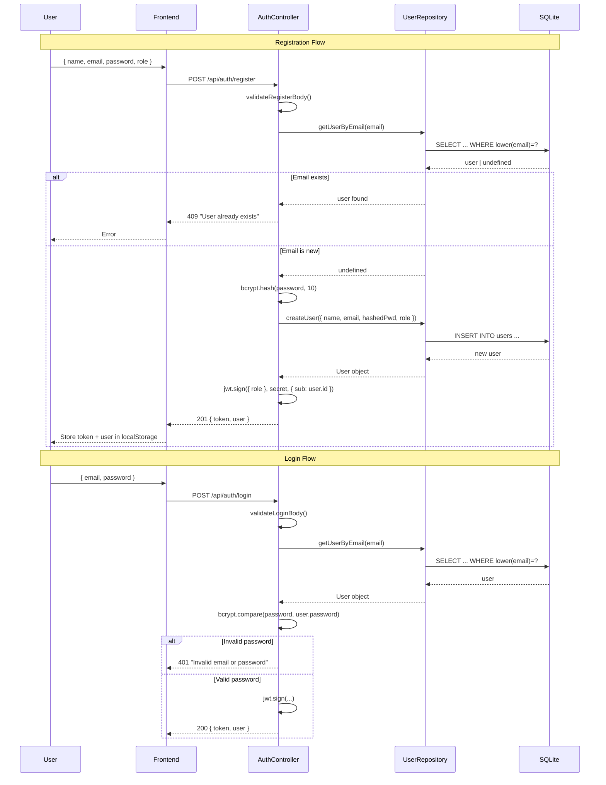
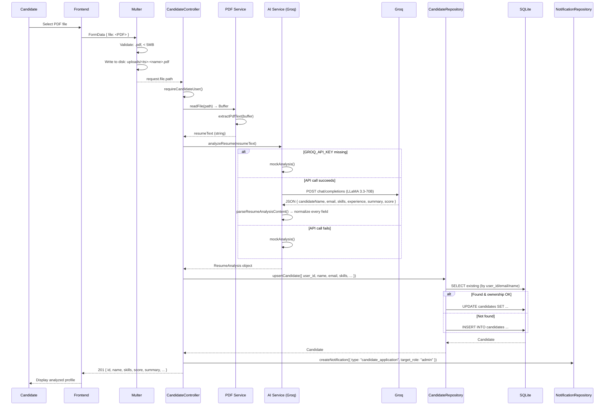
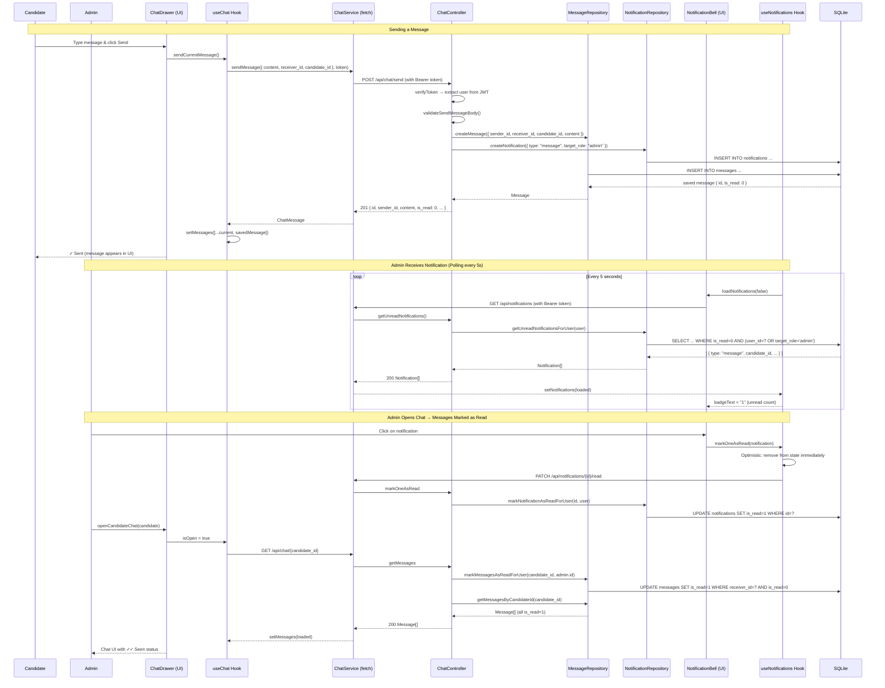

# 🏗️ AI Candidate Screener — Architectural Deep Dive

> A master reference guide for interview candidates to understand every line and design decision in this repository. All code-specific details are preserved in English, with narrative explanations for full comprehension.

---

## Table of Contents

1. [Executive Project Overview & Vision](#1-executive-project-overview--vision)
2. [Backend Architecture Deep Dive (server/)](#2-backend-architecture-deep-dive-server)
   - [Express + TypeScript: Clean Architecture & SRP](#21-express--typescript-clean-architecture--srp)
   - [Authentication & Security (JWT + bcryptjs + RBAC)](#22-authentication--security-jwt--bcryptjs--rbac)
   - [File Upload & PDF Parsing (Multer + pdf-parse)](#23-file-upload--pdf-parsing-multer--pdf-parse)
   - [Database & Data Integrity (SQLite)](#24-database--data-integrity-sqlite)
   - [Error Handling & Async Wrapper](#25-error-handling--async-wrapper)
3. [AI Pipeline & Prompt Engineering (aiService.ts)](#3-ai-pipeline--prompt-engineering-aiservicets)
4. [Frontend Architecture Deep Dive (client/)](#4-frontend-architecture-deep-dive-client)
   - [React + Vite: UI / Hooks / Services Separation](#41-react--vite-ui--hooks--services-separation)
   - [Custom Hooks Explained](#42-custom-hooks-explained)
   - [SSOT Design System: Tailwind v4 + CSS Variables](#43-ssot-design-system-tailwind-v4--css-variables)
   - [Internationalization (i18n) & RTL/LTR](#44-internationalization-i18n--rtlltr)
   - [Real-Time Polling: Chat & Notification Bell](#45-real-time-polling-chat--notification-bell)
5. [Interview Q&A Cheat Sheet: 10 Critical Questions](#5-interview-qa-cheat-sheet-10-critical-questions)

---

## 1. Executive Project Overview & Vision

### 📌 The Problem This SaaS Solves

**AI Candidate Screener** is a full-stack web application for automating resume screening in recruitment. It addresses:

- **Time wasted on manual reading:** Instead of an Admin reading hundreds of CVs manually, AI extracts key information and scores the candidate.
- **Unorganized data:** AI extracts skills, experience, projects, and multilingual summaries (English, French, Arabic), storing them in a structured database.
- **Communication friction:** The app provides a built-in Chat system between Candidates and Admins with real-time notifications.
- **Role separation (RBAC):** Each role (Candidate/Admin) has its own interface and distinct permission levels.

### 🏗️ Full System Architecture Diagram

```
┌─────────────────────────────────────────────────────────┐
│                    Frontend (React + Vite)               │
│  ┌─────────────────────────────────────────────────────┐│
│  │  Components (JSX/TSX)                              ││
│  │  - AuthForm, CandidatePortal, AdminDashboard       ││
│  │  - ChatDrawer, NotificationBell, ProfileModal      ││
│  ├─────────────────────────────────────────────────────┤│
│  │  Hooks (Logic & State)                              ││
│  │  - useAuth, useCandidates, useChat, useNotifications││
│  ├─────────────────────────────────────────────────────┤│
│  │  Services (API Calls)                               ││
│  │  - authService, candidateService, chatService,      ││
│  │    notificationService, http                        ││
│  └─────────────────────────────────────────────────────┘│
└───────────────────────┬─────────────────────────────────┘
                        │ HTTP (fetch) JSON API
                        │ Bearer Token (JWT)
┌───────────────────────▼─────────────────────────────────┐
│              Backend (Express + TypeScript)              │
│  ┌─────────────────────────────────────────────────────┐│
│  │  Routes  →  Controllers  →  Repositories/Services  ││
│  │  /api/auth          → authController               ││
│  │  /api/candidates    → candidateController           ││
│  │  /api/chat          → chatController                ││
│  │  /api/notifications → notificationController        ││
│  ├─────────────────────────────────────────────────────┤│
│  │  Middleware Chain: verifyToken → checkAdmin → ...   ││
│  └─────────────────────────────────────────────────────┘│
└───────┬──────────────────────────┬──────────────────────┘
        │                          │
        ▼                          ▼
┌───────────────┐    ┌───────────────────────────────┐
│   SQLite      │    │   Groq AI (LLaMA 3.3-70B)      │
│  (better-sqlite3) │   │   via OpenAI SDK            │
│               │    │   mock fallback when no API Key │
│  - users       │    └───────────────────────────────┘
│  - candidates  │                │
│  - messages    │    ┌───────────▼───────────────────┐
│  - notifications│    │   PDF Parser (pdf-parse)      │
└───────────────┘    │   extracts text from PDFs      │
                     └───────────────────────────────┘
```

**Basic Candidate Flow:**
1. Candidate registers → receives JWT Token
2. Submits resume (text or PDF) → backend extracts PDF text (if applicable) → sends to Groq AI
3. AI analyzes the resume and returns structured JSON (skills, experience, score, multilingual summary)
4. Data saved to SQLite → notification sent to Admin
5. Admin sees the new candidate in the dashboard, can open Chat and communicate

---

## 2. Backend Architecture Deep Dive (server/)

### 2.1 Express + TypeScript: Clean Architecture & SRP

The backend is built with **Express v5** and **TypeScript**, strictly applying **Separation of Concerns** across 4 layers:

```
Routes (ultra-light, only map URLs to Controllers)
   ↓
Controllers (validate input, call Repositories/Services, send JSON)
   ↓
Repositories (SQL queries only) / Services (complex business logic)
   ↓
Database (SQLite) / External APIs (Groq AI, PDF Parse)
```

#### 🧩 Routes — Featherweight

Routes contain **zero business logic and zero SQL**. Example from `server/src/routes/auth.ts`:

```typescript
export const createAuthRouter = ({...}): Router => {
  const router = Router();
  const controller = createAuthController({ jwtSecret, userRepository });

  router.post("/login", controller.login);
  router.get("/me", verifyToken, controller.getMe);

  return router;
};
```

**Key design choice:** Every Router uses **Dependency Injection via Factory Functions**. This makes Routes easily testable by passing Mock Repositories in tests.

#### 🧩 Controllers — The Gatekeepers

Controllers are responsible for:
- **Extracting the authenticated user** from `request.authenticatedUser` (set by middleware)
- **Validating** the Request Body
- **Orchestrating** between Repositories and Services
- **Sending JSON responses** with appropriate Status Codes

Example from `authController.ts` — Login flow:

```typescript
login: async (request, response): Promise<void> => {
  // 1. Validate request body
  const validation = validateLoginBody(request.body);
  if (!validation.success) { sendError(response, 400, validation.error); return; }

  try {
    // 2. Look up user in database
    const user = userRepository.getUserByEmail(validation.body.email);
    if (user === undefined) { sendError(response, 401, "Invalid email or password"); return; }

    // 3. Verify password
    const isPasswordValid = await bcrypt.compare(validation.body.password, user.password);
    if (!isPasswordValid) { sendError(response, 401, "Invalid email or password"); return; }

    // 4. Return JWT Token
    response.status(200).json(createAuthResponse(user, jwtSecret));
  } catch {
    sendError(response, 500, "Failed to login");
  }
}
```

#### 🧩 Repositories — Data Store Workers

Every Repository uses **Prepared Statements** (for performance and SQL injection safety) and writes SQL only.

| Repository | Responsibility |
|---|---|
| `userRepository` | Create, find, update users |
| `candidateRepository` | Candidate CRUD with UPSERT and anti-duplication |
| `messageRepository` | Create and query messages, update is_read |
| `notificationRepository` | Create, query, and manage notifications |

#### 🧩 Services — External Specialists

- `services/ai.ts` — Communicates with Groq API for resume analysis
- `services/pdf.ts` — Extracts text from PDF files

---

### 2.2 Authentication & Security (JWT + bcryptjs + RBAC)

#### 🔐 Full Authentication Flow

**Register:**
```
User sends { name, email, password, role }
  → validateRegisterBody() checks all fields exist and are valid
  → userRepository.getUserByEmail() — does the email already exist? (→ 409 Conflict)
  → bcrypt.hash(password, 10) — hash password with 10 Salt Rounds
  → userRepository.createUser() — save new user to SQLite
  → jwt.sign({ role }, secret, { subject: String(user.id), expiresIn: "7d" })
  → Response: { token, user: { id, name, email, role } }
```

**Login:**
```
User sends { email, password }
  → userRepository.getUserByEmail() — find by email
  → bcrypt.compare(password, user.password) — verify password
  → Create JWT Token (same steps as Register)
  → Response: { token, user }
```

#### 🔄 Auth Flow Sequence Diagram (Mermaid)



#### 🔐 Middleware Deep Dive: verifyToken and checkAdmin

**verifyToken — The First Gatekeeper:**

```typescript
// 1. Extract Bearer Token from Header
const token = getBearerToken(request.headers.authorization);
// → Authorization: Bearer <token>

// 2. Decode JWT and verify signature
const userId = getUserIdFromToken(token, jwtSecret);
// → jwt.verify(token, jwtSecret) returns payload { sub: "1", role: "admin" }
// → Validate that sub is a positive integer

// 3. Look up user in database
const user = userRepository.getUserById(userId);
// → If not found → 401

// 4. Attach user to Request for downstream handlers
request.authenticatedUser = user;
next();
```

**checkAdmin — The Second Gatekeeper:**

```typescript
const checkAdmin = (request, response, next) => {
  const user = getAuthenticatedUser(request);
  if (user === null) return sendError(response, 401);
  if (user.role !== "admin") return sendError(response, 403, "Admin access is required");
  next();
};
```

**Critical security note:** The user identity is extracted from the JWT (not from the request body), preventing any impersonation attacks.

#### 🔐 JWT Payload Structure

```typescript
{
  role: "candidate" | "admin",  // for RBAC authorization
  sub: "1",                      // user id
  iat: 1700000000,               // issued at
  exp: 1700600000                // expires: 7 days
}
```

---

### 2.3 File Upload & PDF Parsing (Multer + pdf-parse)

#### 📄 PDF Upload Flow

```
Frontend sends FormData with { file: <PDF> }
  → multer middleware receives the file and writes it to disk
  → uploads/<timestamp>-<sanitized_filename>.pdf
  → Controller reads the file from disk: readFile(request.file.path)
  → extractPdfText(pdfBuffer) uses the pdf-parse library to extract text
  → analyzeResume(resumeText) sends text to Groq AI
  → File is deleted from disk when the candidate is deleted
```

#### 🔄 Resume Upload & Analysis Sequence Diagram (Mermaid)



#### 📄 Multer Configuration

```typescript
const uploadSinglePdf = multer({
  storage: multer.diskStorage({
    destination: (_, __, callback) => callback(null, uploadsDirectory),
    filename: (_, file, callback) =>
      callback(null, `${Date.now()}-${sanitizeFileName(file.originalname)}`),
  }),
  limits: { fileSize: 5 * 1024 * 1024 },  // Max: 5MB
  fileFilter: (_, file, callback) => {
    if (extname(file.originalname).toLowerCase() !== ".pdf") {
      callback(new Error("Only PDF files are allowed"));
      return;
    }
    callback(null, true);
  },
}).single("file");
```

#### 📄 File Deletion Safety

When a candidate is deleted, `deleteUploadedPdfFile` safely removes the PDF from disk. It uses `resolveUploadedPdfPath` which validates the path is within the `uploads/` directory (Path Traversal Protection):

```typescript
const relativeFilePath = relative(uploadsRoot, uploadedFilePath);
if (relativeFilePath.startsWith("..") || isAbsolute(relativeFilePath)) return null;
```

---

### 2.4 Database & Data Integrity (SQLite)

#### 🗃️ Four Core Tables

#### 🔄 Database Schema Entity-Relationship Diagram (ERD)

```mermaid
erDiagram
    users ||--o{ candidates : "user_id"
    users ||--o{ messages : "sender_id"
    users ||--o{ messages : "receiver_id"
    users ||--o{ notifications : "user_id"
    users ||--o{ notifications : "sender_id"
    candidates ||--o{ messages : "candidate_id"
    candidates ||--o{ notifications : "candidate_id"

    users {
        int id PK
        string name UK
        string email UK
        string password
        string role "candidate | admin"
        datetime created_at
    }

    candidates {
        int id PK
        int user_id FK
        string name UK
        string email UK
        string phone
        string linkedin
        string github
        string pdf_url
        string skills "JSON"
        string experience "JSON"
        string projects "JSON"
        string summary "JSON"
        int score "1-100"
        datetime created_at
    }

    messages {
        int id PK
        int sender_id FK
        int receiver_id FK
        int candidate_id FK
        string content
        int is_read "0|1"
        datetime created_at
    }

    notifications {
        int id PK
        int user_id FK
        string target_role "candidate|admin"
        int candidate_id FK "ON DELETE SET NULL"
        int sender_id FK "ON DELETE SET NULL"
        string type
        string title
        string content
        int is_read "0|1"
        datetime created_at
    }

    users_email_unique_idx: UNIQUE INDEX ON users(lower(email))
    candidates_email_unique_idx: UNIQUE INDEX ON candidates(lower(email)) WHERE email IS NOT NULL
    candidates_name_unique_idx: UNIQUE INDEX ON candidates(lower(name))
    messages_candidate_created_idx: INDEX ON messages(candidate_id, created_at, id)
    notifications_user_unread_idx: INDEX ON notifications(user_id, is_read, created_at, id)
    notifications_role_unread_idx: INDEX ON notifications(target_role, is_read, created_at, id)
    notifications_candidate_idx: INDEX ON notifications(candidate_id, created_at, id)
```

**1. users**
```sql
CREATE TABLE users (
  id INTEGER PRIMARY KEY AUTOINCREMENT,
  name TEXT NOT NULL,
  email TEXT UNIQUE NOT NULL,
  password TEXT NOT NULL,
  role TEXT NOT NULL DEFAULT 'candidate' CHECK (role IN ('candidate', 'admin')),
  created_at DATETIME DEFAULT CURRENT_TIMESTAMP
);
```

**2. candidates — analyzed resume data**
```sql
CREATE TABLE candidates (
  id INTEGER PRIMARY KEY AUTOINCREMENT,
  user_id INTEGER REFERENCES users(id),
  name TEXT NOT NULL,
  email TEXT UNIQUE,
  phone TEXT,
  linkedin TEXT, github TEXT,
  pdf_url TEXT,
  skills TEXT,        -- JSON string
  experience TEXT,     -- JSON string
  projects TEXT,       -- JSON string
  summary TEXT,        -- JSON string (LocalizedSummary)
  score INTEGER CHECK (score IS NULL OR score BETWEEN 1 AND 100),
  created_at DATETIME DEFAULT CURRENT_TIMESTAMP
);
```

**3. messages — chat messages**
```sql
CREATE TABLE messages (
  id INTEGER PRIMARY KEY AUTOINCREMENT,
  sender_id INTEGER NOT NULL REFERENCES users(id),
  receiver_id INTEGER NOT NULL REFERENCES users(id),
  candidate_id INTEGER NOT NULL REFERENCES candidates(id),
  content TEXT NOT NULL,
  is_read INTEGER NOT NULL DEFAULT 0 CHECK (is_read IN (0, 1)),
  created_at DATETIME DEFAULT CURRENT_TIMESTAMP
);
```

**4. notifications**
```sql
CREATE TABLE notifications (
  id INTEGER PRIMARY KEY AUTOINCREMENT,
  user_id INTEGER REFERENCES users(id),
  target_role TEXT CHECK (target_role IN ('candidate', 'admin')),
  candidate_id INTEGER REFERENCES candidates(id) ON DELETE SET NULL,
  sender_id INTEGER REFERENCES users(id) ON DELETE SET NULL,
  type TEXT NOT NULL,  -- 'candidate_application' | 'message'
  title TEXT NOT NULL,
  content TEXT NOT NULL,
  is_read INTEGER NOT NULL DEFAULT 0 CHECK (is_read IN (0, 1)),
  created_at DATETIME DEFAULT CURRENT_TIMESTAMP
);
```

#### 🗃️ Foreign Keys & Cascading Deletes

**`PRAGMA foreign_keys = ON;`** — activated at database connection time. This ensures:

- `candidates.user_id → users.id`: No candidate without a valid user
- `messages.candidate_id → candidates.id`: No message referencing a non-existent candidate
- `notifications.candidate_id → candidates.id ON DELETE SET NULL`: When a candidate is deleted, related notifications get `candidate_id = NULL` (instead of being deleted outright)
- `notifications.sender_id → users.id ON DELETE SET NULL`: When a user is deleted, their sent notifications don't lose the entire row

**Cascading Delete in Action:**

In `candidateRepository.deleteCandidateWithRelatedRecords`:

```typescript
const deleteCandidateWithRelatedRecords = database.transaction((id) => {
  const candidate = getCandidateById(id);               // 1. Verify candidate exists
  deleteMessagesByCandidateIdStatement.run(id);          // 2. Delete all associated messages
  deleteNotificationsByCandidateIdStatement.run(id);     // 3. Delete all associated notifications
  deleteCandidateStatement.run(id);                      // 4. Delete the candidate
});
```

This uses `database.transaction()` to ensure **Atomicity** — either everything is deleted or nothing is.

#### 🗃️ Indexes for Query Performance

Seven Indexes optimize the most frequent query patterns:

```sql
-- Fast email lookup (case-insensitive)
CREATE UNIQUE INDEX users_email_unique_idx ON users (lower(email));

-- Prevent duplicate candidates by email
CREATE UNIQUE INDEX candidates_email_unique_idx ON candidates (lower(email)) WHERE email IS NOT NULL;

-- Prevent duplicate candidates by name
CREATE UNIQUE INDEX candidates_name_unique_idx ON candidates (lower(name));

-- Fast message retrieval by candidate
CREATE INDEX messages_candidate_created_idx ON messages (candidate_id, created_at, id);

-- Fast unread notification retrieval per user
CREATE INDEX notifications_user_unread_idx ON notifications (user_id, is_read, created_at, id);

-- Fast role-based notification retrieval (Admin sees all candidate notifications)
CREATE INDEX notifications_role_unread_idx ON notifications (target_role, is_read, created_at, id);

-- Fast notification lookup by candidate
CREATE INDEX notifications_candidate_idx ON notifications (candidate_id, created_at, id);
```

#### 🗃️ UPSERT Strategy & Anti-Duplication

In `candidateRepository.upsertCandidate`:

1. **Look up existing candidate** with multi-criteria search (priority-ordered):
   - `user_id`: If the user already has a candidate → use it
   - `email`: If the email exists → use it
   - `name`: If the name exists → use it
2. **Ownership check:** If an existing candidate is found and the new `user_id` differs from the old one → `return undefined` (Conflict)
3. **Found → UPDATE** the existing record
4. **Not found → INSERT** a new record

#### 🗃️ Migration-Friendly Design

`initializeDatabase` uses `CREATE TABLE IF NOT EXISTS` and never drops existing tables. Safe column additions are handled through `addMissing*Columns` functions that inspect existing columns via `PRAGMA table_info`:

```typescript
const existingColumns = new Set(
  database.prepare("PRAGMA table_info(users)").all().map(c => c.name)
);
for (const column of columnsToAdd) {
  if (!existingColumns.has(column.name)) {
    database.exec(`ALTER TABLE users ADD COLUMN ${column.name} ${column.definition};`);
  }
}
```

A deduplication pass (`deduplicateCandidates`) runs at startup to clean up any duplicates that may have existed before the UNIQUE indexes were added.

---

### 2.5 Error Handling & Async Wrapper

**There is no global try/catch wrapper.** Instead, every Controller function handles its own errors:

```typescript
try {
  // business logic
} catch {
  sendError(response, 500, "Failed to do X");
}
```

#### 📋 Standard Status Code Guide

| Status | Meaning | When Used |
|---|---|---|
| `200 OK` | Success | Read, update, delete, login |
| `201 Created` | Resource created | Candidate creation, resume analysis, message sent |
| `400 Bad Request` | Invalid input | Missing field, wrong value, PDF > 5MB |
| `401 Unauthorized` | Not authenticated | Missing/invalid token |
| `403 Forbidden` | Permission denied | Non-admin accessing admin-only endpoint |
| `404 Not Found` | Not found | Candidate/user doesn't exist |
| `409 Conflict` | Duplicate/conflict | Email already registered |
| `500 Internal Server Error` | Server failure | Unexpected error |

#### 📋 Unified Error Response Format

All error responses follow:
```json
{ "error": "Description" }
```

**Utility Functions in `http.ts`:**
```typescript
export const sendError = (response, statusCode, message) => {
  response.status(statusCode).json({ error: message });
};

export const isRecord = (value): boolean =>
  typeof value === "object" && value !== null && !Array.isArray(value);

export const parsePositiveInteger = (value: string): number | null => {
  if (!/^[1-9]\d*$/.test(value)) return null;
  return Number(value);
};
```

---

## 3. AI Pipeline & Prompt Engineering (aiService.ts)

### 🤖 How Groq API Is Integrated

The project uses the **OpenAI SDK** to talk to the **Groq API** (since Groq is OpenAI-compatible):

```typescript
const GROQ_BASE_URL = "https://api.groq.com/openai/v1";
const GROQ_MODEL = "llama-3.3-70b-versatile";

const createOpenAIClient = (): OpenAI | null => {
  if (!process.env.GROQ_API_KEY) return null;  // ← No API Key = Mock Mode
  return new OpenAI({ apiKey: process.env.GROQ_API_KEY, baseURL: GROQ_BASE_URL });
};
```

### 🤖 The Prompt Engineering Breakdown

```typescript
messages: [
  {
    role: "system",
    content: "You analyze resumes for software engineering roles. Respond only with strict JSON. Do not include markdown, comments, or extra text.",
  },
  {
    role: "user",
    content: `Analyze this resume text and return JSON with exactly these fields: {
  "candidateName": "string",
  "email": "string or null",
  "phone": "string or null",
  "linkedin": "string or null",
  "github": "string or null",
  "skills": ["string"],
  "experience": [{ "title", "company", "duration", "description" }],
  "projects": [{ "name", "description", "technologies": ["string"] }],
  "summary": {
    "en": "short 2-sentence English summary",
    "fr": "short 2-sentence French summary",
    "ar": "short 2-sentence Arabic summary"
  },
  "score": 1
}
Use null for missing contact links. Score must be an integer from 1 to 100.
Resume text: ${resumeText}`
  }
]
```

**Prompt Engineering Techniques Used:**
1. **`response_format: { type: "json_object" }`** — forces Groq to return only JSON
2. **Full Schema specification** with types (string, null, array) for every field
3. **Multilingual Summary** (en, fr, ar) in a single API call — avoiding 3 separate calls
4. **Strict instructions:** "Do not include markdown, comments, or extra text"
5. **Clear System Message** defining the AI's role as "resume analyzer for software engineering roles"

### 🤖 Parsing Safety Net

After receiving raw JSON from Groq, every field passes through `normalize*` functions:

```typescript
export const parseResumeAnalysisContent = (content: string): ResumeAnalysis => {
  try {
    const parsedContent: unknown = JSON.parse(content);
    return {
      candidateName: normalizeText(parsedContent.candidateName, "Unknown Candidate"),
      email: normalizeNullableText(parsedContent.email),
      skills: normalizeSkills(parsedContent.skills),     // ← guarantees string[]
      experience: normalizeExperience(parsedContent.experience),
      summary: normalizeLocalizedSummary(parsedContent.summary, FALLBACK_SUMMARY),
      score: normalizeScore(parsedContent.score),        // ← clamps to 1-100
    };
  } catch {
    return fallbackAnalysis();  // ← any JSON error → safe fallback
  }
};
```

**Normalizer examples:**
- `normalizeScore`: If `score` is not a number, returns 1. If it's out of range, clamps to `Math.min(100, Math.max(1, Math.round(value)))`.
- `normalizeSkills`: If `skills` is not an array, returns `[]`. Filters out non-string values.
- `normalizeLocalizedSummary`: Accepts either a string (copied to all 3 languages) or a full `{ en, fr, ar }` object.

### 🤖 Mock Fallback — Local Development Without AI

When `GROQ_API_KEY` is missing OR the API call fails, the system falls back to mock data:

```typescript
if (openai === null) return mockAnalysis(trimmedResumeText);

try {
  // call Groq API
} catch {
  return mockAnalysis(trimmedResumeText);  // ← API failed? Use Mock
}
```

This enables local development without any API key and ensures the app never crashes due to external service outages.

---

## 4. Frontend Architecture Deep Dive (client/)

### 4.1 React + Vite: UI / Hooks / Services Separation

The frontend is divided into 3 distinct layers:

```
Components (UI only)
  ├── Receives props and calls callbacks
  ├── Contains no fetch, localStorage, or polling intervals
  └── Uses useTranslation() for all text
        ↓
Hooks (Logic & State)
  ├── Contains useState, useEffect, useMemo
  ├── Manages Token in localStorage
  ├── Polling intervals
  └── Error handling functions
        ↓
Services (HTTP Requests)
  ├── fetch() with getAuthHeaders()
  ├── Response and JSON parsing
  └── getErrorMessage() — extracts { error } from Response
```

**Why this separation?**
- **Testability:** Services and Hooks can be tested independently
- **Reusability:** Any Component needing chat uses the `useChat` Hook
- **Maintainability:** Changing token storage strategy doesn't affect Components

**Example Flow — Resume Analysis:**

```
CandidatePortal (Component)
  → user calls onAnalyzeResume(resumeText) [Callback]
    → useCandidates.submitResumeText()
      → candidateService.analyzeResume(text, token) [Service]
        → fetch POST /api/candidates/analyze { resumeText }
          ← { id, name, skills, ... } [Response JSON]
      ← setCandidateProfile(createdCandidate)
      ← setStatusMessage({ type: "success", text: "..." })
```

---

### 4.2 Custom Hooks Explained

#### 🔧 `useAuth` — Authentication Management

```typescript
function useAuth(): UseAuthResult {
  const [authSession, setAuthSession] = useState<AuthSession | null>(
    getStoredAuthSession,  // ← Initialize from localStorage
  );

  const login = async (email, password) => {
    const authResponse = await loginUser(email, password);  // ← Service call
    completeAuthentication(authResponse);                   // ← Save to state + localStorage
    return authResponse;
  };

  const logout = () => {
    clearStoredAuthSession();  // ← Remove from localStorage
    setAuthSession(null);      // ← Update state
  };
}
```

**localStorage Keys:**
- `aiCandidateScreener.token` → The JWT Token
- `aiCandidateScreener.user` → JSON.stringify(user)

On app startup, `getStoredAuthSession` validates stored data against the expected Interface using **Type Guard** functions (`isStoredUser`). If validation fails, the session is cleared rather than crashing.

#### 🔧 `useCandidates` — Candidate List Management

This is the most complex Hook:

```typescript
function useCandidates(authSession) {
  const [candidates, setCandidates] = useState<Candidate[]>([]);
  const [candidateProfile, setCandidateProfile] = useState<Candidate | null>(null);
  const [searchTerm, setSearchTerm] = useState('');
  const [candidateSortOption, setCandidateSortOption] = useState('newest-first');
  const [statusMessage, setStatusMessage] = useState<StatusMessage | null>(null);

  // Initial load when authSession changes
  useEffect(() => {
    void loadCandidates();
  }, [authSession]);

  // Filtered + sorted list (Derived State) — computed not stored
  const visibleCandidates = useMemo(() =>
    sortCandidates(
      candidates.filter(c => candidateMatchesSearch(c, searchTerm)),
      candidateSortOption
    ),
    [candidates, candidateSortOption, searchTerm],
  );

  return { candidates, visibleCandidates, submitResumeText, uploadResumePdf, deleteCandidate, ... };
}
```

**Note:** When `authSession.user.role === 'candidate'`, only `candidateProfile` is populated (a single candidate) and `candidates` is not displayed.

**Admin-specific logic:** When the user is an admin, `adminUsers` is also fetched to enable chat with candidates.

#### 🔧 `useChat` — Real-Time Chat with Polling

```typescript
function useChat({ authToken, candidateId, isOpen, receiverId }) {
  const [messages, setMessages] = useState<ChatMessage[]>([]);

  // useCallback to prevent function recreation on every render
  const loadMessages = useCallback(async (showLoadingState) => {
    const loadedMessages = await getMessages(candidateId, authToken);
    setMessages(loadedMessages);
  }, [authToken, candidateId]);

  // Polling every 3 seconds
  useEffect(() => {
    if (!isOpen) return;
    const initialLoadId = setTimeout(() => loadMessages(true), 0);
    const pollingId = setInterval(() => loadMessages(false), 3000);
    return () => { clearTimeout(initialLoadId); clearInterval(pollingId); };
  }, [isOpen, loadMessages]);

  // Auto-scroll on new messages
  useEffect(() => {
    messagesEndRef.current?.scrollIntoView({ block: 'end' });
  }, [messages]);

  const sendCurrentMessage = async () => {
    const savedMessage = await sendMessage({ candidate_id, content, receiver_id }, authToken);
    setMessages(current => [...current, savedMessage]);
    setMessageText('');
  };
}
```

**Why polling and not WebSockets?** Simplicity. This recruitment chat doesn't need real-time stock-trading latency. Polling is cheaper to implement and doesn't require WebSocket servers. See Q&A for more details.

#### 🔄 Chat & Notification Flow Sequence Diagram (Mermaid)



#### 🔧 `useNotifications` — Notification Polling

```typescript
function useNotifications(authToken) {
  const [notifications, setNotifications] = useState<NotificationItem[]>([]);

  // Polling every 5 seconds
  useEffect(() => {
    const pollingId = setInterval(() => loadNotifications(false), 5000);
    return () => clearInterval(pollingId);
  }, [authToken]);

  // unreadCount = notifications.length (because only unread are fetched)
  const unreadCount = notifications.length;
  const badgeText = unreadCount > 9 ? '9+' : String(unreadCount);

  const markOneAsRead = async (notification) => {
    // Optimistic Update: remove notification from state immediately
    setNotifications(current => current.filter(n => n.id !== notification.id));
    await markNotificationAsRead(notification.id, authToken);
  };
}
```

**Optimistic Update:** The notification is removed from state immediately before the API response arrives, making the UI feel instant.

---

### 4.3 SSOT Design System: Tailwind v4 + CSS Variables

#### 🎨 Single Source of Truth Principle

Instead of hardcoding Hex colors in every Component (like `bg-[#047857]`), everything is defined in `client/src/index.css`:

**Light Mode CSS Variables:**
```css
:root {
  --color-primary: #047857;
  --color-background: #f8fafc;
  --color-surface: #ffffff;
  --color-text-main: #18181b;
  /* ... ~40 variables total ... */
}
```

**Dark Mode — Every variable changes when `.dark` class is added:**
```css
:root.dark {
  --color-primary: #34d399;
  --color-background: #0f172a;
  --color-surface: #111827;
  --color-text-main: #f8fafc;
  /* ... all colors invert ... */
}
```

#### 🎨 Reusable Component Classes

Every repeated visual pattern is defined as a Tailwind Component Class:

```css
@layer components {
  .btn-primary {
    @apply inline-flex items-center justify-center gap-2 text-sm font-semibold outline-none;
    background: var(--color-text-main);
    color: var(--color-surface);
    border-radius: var(--radius-control);
  }
  .btn-primary:hover:not(:disabled) { background: var(--color-text-main-hover); }

  .card-base {
    @apply border shadow-sm;
    background: var(--color-surface);
    border-color: var(--color-border);
    border-radius: var(--radius-control);
  }

  .chat-bubble-mine {
    background: var(--color-chat-mine);
    color: var(--color-chat-mine-text);
  }
}
```

**Available component classes:**
| Class | Purpose |
|---|---|
| `btn-primary`, `btn-secondary`, `btn-danger`, `btn-accent`, `btn-neutral` | Button variants |
| `btn-icon` | Icon-only circle button |
| `card-base`, `card-header`, `card-interactive` | Card containers |
| `input-field`, `input-file`, `field-label` | Form controls |
| `segmented-control`, `segmented-option`, `segmented-option-active` | Tab-like toggle |
| `badge-status`, `badge-skill`, `badge-chip` | Status/skill badges |
| `badge-status-success`, `badge-status-warning`, `badge-status-danger` | Score tone badges |
| `modal-backdrop`, `modal-content` | Modal overlays |
| `drawer-backdrop`, `drawer-panel` | Slide-in drawers |
| `chat-bubble`, `chat-bubble-mine`, `chat-bubble-other` | Chat messages |
| `message-read-status`, `message-read-status-sent`, `message-read-status-seen` | Message receipts |
| `status-alert-success`, `status-alert-error`, `status-alert-warning` | Status banners |
| `notification-count`, `notification-dot` | Notification indicators |
| `empty-state` | Empty state placeholders |
| `text-link` | Inline links |
| `section-eyebrow`, `section-title`, `subsection-label` | Typography |
| `timeline-dot` | Timeline/history points |

#### 🎨 How Theme Toggle Works

```
ThemeToggle Component
  → useTheme() → returns { theme, toggleTheme }
    → toggleTheme():
      → theme === 'dark' ? 'light' : 'dark'
      → localStorage.setItem('app-theme', newTheme)
      → document.documentElement.classList.toggle('dark')
      → Update React state
```

`ThemeProvider` uses `matchMedia('(prefers-color-scheme: dark)')` to detect system preferences on initial load, ensuring the app respects the user's OS-level theme choice.

---

### 4.4 Internationalization (i18n) & RTL/LTR

#### 🌐 Setup

```typescript
// client/src/i18n.ts
import i18n from 'i18next';
import LanguageDetector from 'i18next-browser-languagedetector';
import { initReactI18next } from 'react-i18next';

void i18n
  .use(LanguageDetector)      // ← Auto-detects browser language
  .use(initReactI18next)      // ← Bridges i18n with React
  .init({
    resources: { en: { translation: en }, fr: { translation: fr }, ar: { translation: ar } },
    fallbackLng: 'en',
    detection: {
      order: ['localStorage', 'navigator'],  // ← localStorage first, then browser
      caches: ['localStorage'],
    },
  });
```

The detection order ensures user preference (stored in localStorage) takes precedence over browser language.

#### 🌐 Direction Handling (RTL/LTR)

`applyDocumentLanguage` is called on every language change:

```typescript
export const getTextDirection = (language: string): TextDirection =>
  resolveLanguage(language) === 'ar' ? 'rtl' : 'ltr';

export const applyDocumentLanguage = (language: string): void => {
  document.documentElement.lang = resolvedLanguage;
  document.documentElement.dir = getTextDirection(resolvedLanguage);
};
```

When Arabic is selected:
- `dir` changes to `rtl` (right-to-left)
- `lang` changes to `ar`
- Text displays right-to-left
- CSS `dir`-dependent layouts (flexbox directions) auto-invert
- Screen readers detect the correct language

A `languageChanged` event listener on the i18n instance ensures `applyDocumentLanguage` fires on every language switch.

#### 🌐 Translation File Structure

```
client/src/locales/
├── en.json  → English
├── fr.json  → French
└── ar.json  → Arabic
```

All three files share the same JSON key structure:

```json
{
  "auth": {
    "titles": {
      "login": "Welcome back",
      "register": "Create an account"
    }
  }
}
```

In Components:
```tsx
const { t } = useTranslation();
return <h1>{t('auth.titles.login')}</h1>;
```

**Rule: Never hardcode user-facing strings in JSX.** Every text node must use the `t()` function.

#### 🌐 Language Detection and Resolution

The `LanguageDetector` plugin checks localStorage (`i18nextLng` key) first, then falls back to the browser's `navigator.language`. If the detected language is not `en`, `fr`, or `ar`, it falls back to English:

```typescript
export const resolveLanguage = (language: string): SupportedLanguageCode => {
  const baseLanguage = language.split('-')[0]?.toLowerCase();
  if (baseLanguage === 'en' || baseLanguage === 'fr' || baseLanguage === 'ar') {
    return baseLanguage;
  }
  return 'en';
};
```

---

### 4.5 Real-Time Polling: Chat & Notification Bell

#### 🔄 Chat Polling

**Why polling over WebSockets?** Simplicity. The app doesn't require sub-second latency. Polling is cheaper to implement and doesn't require WebSocket infrastructure.

```
Every 3 seconds:
  GET /api/chat/{candidate_id}
  → Update message list
  → Update is_read status (Sent vs Seen)

On opening chat:
  → Messages are marked as read for the current user
  ← PATCH /api/notifications/{id}/read
```

**Message Read Receipts:**
```tsx
<MessageReadStatus isRead={message.is_read} />
// isRead = 0 → "✓ Sent" (delivered)
// isRead = 1 → "✓✓ Seen" (read)
```

The CSS separates Sent (subtle color `--color-text-subtle`) from Seen (blue `--color-message-seen`).

**How messages are marked as read:**

When `getMessages` is called in the backend Controller:
```typescript
messageRepository.markMessagesAsReadForUser(candidateId, user.id);
```
This updates all unread messages where `receiver_id = currentUserId` to `is_read = 1`.

#### 🔄 Notification Bell Polling

```
Every 5 seconds:
  GET /api/notifications
  → Fetches only unread notifications
  → Displays count in a red badge

On Bell click:
  → Opens dropdown
  → Shows latest notifications

On notification click (type = 'message'):
  → markOneAsRead (Optimistic Update — immediate UI removal)
  → Opens Chat Drawer for the relevant candidate

On "Mark as Read" click:
  → PATCH /api/notifications/read-all
  → Clears all notifications from state
```

**Badge display:** When `unreadCount > 9`, shows `"9+"` to prevent layout issues.

**Date formatting:** Uses `Intl.DateTimeFormat` for locale-aware formatting:
```typescript
new Intl.DateTimeFormat(locale, {
  month: 'short', day: 'numeric', hour: 'numeric', minute: '2-digit'
}).format(date)
```

#### 🔄 Notification ↔ Chat Integration in App.tsx

```typescript
const handleNotificationClick = async (notification) => {
  if (notification.type !== 'message') return;

  // First, try to find the candidate in cached state
  const existingCandidate = findNotificationCandidate(notification, candidates);
  if (existingCandidate) {
    openCandidateChat(existingCandidate);  // ← Opens ChatDrawer
    return;
  }

  // If not found, try refreshing candidates from server
  const loadedCandidates = await refreshCandidates();
  // search again...
};
```

This ensures that even if the notification references a candidate not yet loaded in the UI (e.g., from a different admin's session), the chat can still be opened after fetching fresh data.

---

## 5. Interview Q&A Cheat Sheet: 10 Critical Questions

### Q1: Why did you choose SQLite over PostgreSQL or MongoDB?

**Answer:**

SQLite was chosen because:

1. **Zero configuration:** No separate database server needed. The `screener.db` file is auto-created.
2. **Lightweight:** Perfect for the app's deployment model (Single Server with no horizontal scaling).
3. **High speed:** `better-sqlite3` is a synchronous library that's faster than async database libraries for single-threaded use.
4. **Single-user focus:** The SaaS is small-scale, not needing thousands of concurrent connections.
5. **Zero cost:** No external database hosting fees.

**The Trade-off:** If the app grows to thousands of concurrent users, migration to PostgreSQL with connection pooling would be needed. The current design (Repository Pattern) makes this migration straightforward since SQL is isolated in Repository files.

### Q2: Why use polling instead of WebSockets for chat and notifications?

**Answer:**

1. **Simplicity:** Polling requires no WebSocket setup, connection keep-alive, or Pub/Sub infrastructure (like Redis).
2. **Sufficient for the use case:** 3-5 second intervals are adequate for recruitment chat. We don't need stock-trading latency.
3. **Lower cost:** WebSockets consume more server memory per open connection.
4. **Easy hosting:** Most free-tier hosting services support HTTP polling easily, while WebSockets may need special configuration.

**The Trade-off:** Polling generates redundant network traffic (even when no new messages exist). At 10,000 users, that's ~3,300 requests/second. At that scale, migrating to WebSockets or Server-Sent Events (SSE) would be necessary.

### Q3: How do you prevent duplicate candidates in the database?

**Answer:**

We use a multi-layered strategy:

1. **Database level:** `UNIQUE INDEX` on `lower(email)` and `lower(name)`.
2. **Repository level:** The `upsertCandidate` function searches for existing candidates with priority ordering:
   - `user_id` (highest priority)
   - `email` (medium priority)
   - `name` (lowest priority)
3. **Ownership Conflict Check:** If a different user tries to update a candidate owned by another user, `undefined` is returned (Conflict).

### Q4: How do you handle AI API failures in production?

**Answer:**

Three layers of protection:

1. **Mock Fallback:** When `GROQ_API_KEY` is missing or the API call fails, `mockAnalysis()` returns realistic mock data.
2. **Parsing Fallback:** If the API returns non-JSON or malformed content, `fallbackAnalysis()` returns "Please review manually."
3. **Normalizers:** Every JSON field is normalized with safe default values. For example, if `score = "abc"`, it becomes `1`.

This ensures **the app never crashes** due to external service issues.

### Q5: Why store `skills`, `experience`, and `summary` as JSON strings in SQLite?

**Answer:**

1. **SQLite lacks native JSON column types** unlike PostgreSQL. Storing as TEXT and parsing in the application layer is the standard approach.
2. **Flexibility:** Candidate skills, projects, and experience vary in structure and length. JSON strings provide flexibility without additional normalized tables.
3. **Safe parsing at read time:** The `toCandidateResponse` function in `candidateResponse.ts` parses JSON with full type validation:
   ```typescript
   skills: parseJsonArray(candidate.skills, (item): item is string => typeof item === "string"),
   ```
   If the JSON is invalid, an empty array `[]` is returned instead of crashing the app.

### Q6: How does the system ensure candidates can only see their own profile?

**Answer:**

RBAC with strict Data Isolation:

1. **In `candidateController.getCandidates`:**
   ```typescript
   if (user.role === "admin") {
     return candidateRepository.getCandidates();           // ← All candidates
   }
   return candidateRepository.getCandidatesByUserId(user.id);  // ← Only their own
   ```

2. **In `candidateController.deleteCandidate`:**
   ```typescript
   if (user.role !== "admin" && candidateToDelete.user_id !== user.id) {
     sendError(response, 404, "Candidate not found");  // ← 404, not 403, for security
   }
   ```
   **Security note:** Returning `404 "Candidate not found"` instead of `403 "Forbidden"` prevents information leakage (a candidate can't probe whether other candidate IDs exist).

3. **On the Frontend:**
   ```typescript
   if (authSession.user.role === "admin") {
     setCandidates(loadedCandidates);              // ← All candidates
   } else {
     setCandidateProfile(loadedCandidates[0] ?? null);  // ← Single candidate
   }
   ```

### Q7: Why use `database.transaction()` when deleting a candidate?

**Answer:**

For **Atomicity** — either everything is deleted or nothing is deleted:

```typescript
const deleteCandidateWithRelatedRecords = database.transaction((id) => {
  const candidate = getCandidateById(id);
  deleteMessagesByCandidateIdStatement.run(id);      // Delete associated messages
  deleteNotificationsByCandidateIdStatement.run(id); // Delete associated notifications
  deleteCandidateStatement.run(id);                   // Delete the candidate
  return candidate;
});
```

Without a transaction, if the server crashed after step 2, some messages would be deleted while the candidate remained. The transaction guarantees that if any step fails, the database performs a full Rollback.

### Q8: Why use Dependency Injection instead of direct imports in Routes?

**Answer:**

Routes use Factory Functions that accept Dependencies as Parameters:

```typescript
export const createCandidatesRouter = ({
  jwtSecret,
  candidateRepository = createCandidateRepository(db),  // ← default value
  analyzeResumeService = analyzeResume,                  // ← default value
}: CreateCandidatesRouterOptions = {}) => { ... };
```

**Benefits:**
1. **Testability:** In `integration.test.ts`, we pass Mock Services:
   ```typescript
   createCandidatesRouter({
     analyzeResumeService: async () => analysis,          // ← Mock AI
     extractPdfTextService: async () => "Resume text...", // ← Mock PDF
   });
   ```
2. **Flexibility:** AI Provider or database can be swapped without changing a single line in Routes.

### Q9: How do you handle file upload security?

**Answer:**

1. **File type restriction:** Multer's `fileFilter` allows only PDFs:
   ```typescript
   if (extname(file.originalname).toLowerCase() !== ".pdf") {
     callback(new Error("Only PDF files are allowed"));
   }
   ```
2. **Size limit:** `limits: { fileSize: 5MB }` prevents large file uploads.
3. **Filename sanitization:** `sanitizeFileName` removes dangerous characters:
   ```typescript
   const sanitizeFileName = (fileName) => fileName.replace(/[^a-zA-Z0-9._-]/g, "-");
   ```
4. **Path Traversal Prevention:** When deleting files, we verify the path stays within `uploads/`:
   ```typescript
   const relativeFilePath = relative(uploadsRoot, uploadedFilePath);
   if (relativeFilePath.startsWith("..") || isAbsolute(relativeFilePath)) return null;
   ```
5. **Never trust the client:** The `user_id` is extracted from JWT, not from FormData.

### Q10: Why is there a `useMemo` in `useCandidates`? When should you use it?

**Answer:**

```typescript
const visibleCandidates = useMemo(
  () => sortCandidates(
    candidates.filter(c => candidateMatchesSearch(c, searchTerm)),
    candidateSortOption,
  ),
  [candidates, candidateSortOption, searchTerm],
);
```

**When to use `useMemo`:**
1. **Performance optimization:** Every time `candidates`, `searchTerm`, or `sortOption` changes, the filtered and sorted list is recalculated. Without `useMemo`, `sortCandidates` and `filter` would run on every Component re-render.
2. **Reference stability:** `visibleCandidates` maintains the same reference as long as the resulting array hasn't changed. This prevents unnecessary re-renders of child Components that receive `visibleCandidates` as a prop.

**When NOT to use it:** Don't use `useMemo` for trivial operations like `name + " " + lastName`. Use it only for expensive computations (Filtering, Sorting, Complex Calculations).

---

## 🎯 Summary

**AI Candidate Screener** is a production-quality full-stack application demonstrating Clean Architecture and Separation of Concerns in a real TypeScript project. Key talking points for interviews:

1. **Strict Layer Separation** — Routes don't know SQL, Controllers don't touch the database, Repositories don't know HTTP
2. **Defense in Depth** — JWT + bcryptjs + RBAC + Path Traversal Protection + Timing Safe Comparison
3. **Failure Resilience** — Mock AI Fallback + Safe JSON Parsing + Fallback Summaries
4. **Testability** — Dependency Injection + Factory Functions
5. **Global Experience** — Multilingual AI Summaries + RTL Support + i18n
6. **CSS SSOT** — Design Tokens via CSS Variables + Dark/Light Mode at a button's click
